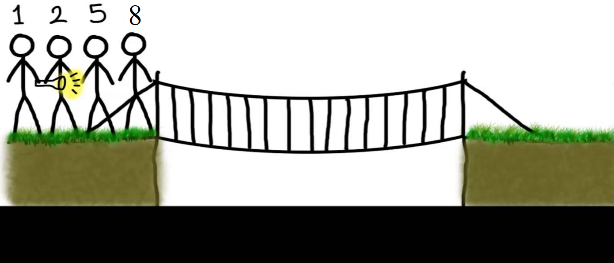

# Solving the bridge and torch problem with python and AI
## Story
Four people come to a river in the night. There is a narrow bridge, but it can only hold two people at a time. They have one torch and, because it's night, the torch has to be used when crossing the bridge. Person A can cross the bridge in 1 minute, B in 2 minutes, C in 5 minutes, and D in 8 minutes. When two people cross the bridge together, they must move at the slower person's pace. The question is, can they all get across the bridge if the torch lasts only 15 minutes?

## Solution approach with AI
The solution is provided as heuristic based random search. The algorithm applies the following constraints to get a final solution. 
* A takes 1 minute to cross the bridge.
* B takes 2 minutes to cross the bridge.
* C takes 5 minutes to cross the bridge.
* D takes 8 minutes to cross the bridge.

There is only one torch with them and the bridge cannot be crossed without the torch. There cannot be more than two persons on the bridge at any time, and when two people cross the bridge together, they must move at the slower person’s pace.

## The code


```python
import random
import pdb
states={
    # False here means that the person didn't pass the bridge
    # True means he/she passed the bridge
    'Torch':False,
    'A':False,
    'B':False,
    'C':False,
    'D':False
}
times={
    # time in minutes, person1 A can pass the bridge in 1 minute
    'A':1,
    'B':2,
    'C':5,
    'D':8
}
two_turn = True
t_max=15
t_total=0
def move_one_person(torch, person):
    global t_total, t_max,states,times, two_turn
    if states[torch] == states[person] and t_total < t_max:
        states[torch] = not states[torch]
        states[person] = not states[person]
        t_total += times[person]
        print('Back ', torch,',', person, 'In', t_total, 'minutes')
        two_turn=True
        
def move_two_persons(torch, person1, person2):
    global t_total, t_max, states, times, two_turn
    if states[torch] == states[person1] == states[person2] and t_total < t_max:
        states[torch] = not states[torch]
        states[person1] = not states[person1]
        states[person2] = not states[person2]
        t_total += max(times[person1], times[person2])
        print('Forward ', torch, ',', person1,',', person2, 'In', t_total, 'minutes')
        two_turn=False
        
def get_list(passed=False):
    # let's select the moved persons, passed the bridge persons(passed). or the stayed persons (wait)
    global states
    list_passed=[]
    list_wait=[]
    if states['A']:
        list_passed.append('A')
    else:
        list_wait.append('A')
    if states['B']:
        list_passed.append('B')
    else:
        list_wait.append('B')
    if states['C']:
        list_passed.append('C')
    else:
        list_wait.append('C')
    if states['D']:
        list_passed.append('D')
    else:
        list_wait.append('D')
    if passed:
        return list_passed
    else:
        return list_wait
    
def is_final_state():
    # our goal is to check that all persons are passed
    global states, t_total,t_max
    # the final state will be arrived if all persons and torch are moved to the other side of the bridge and 
    # they spend maximum 17 minutes in the moving process. 
    if states['Torch'] and states['A'] and states['B'] and states['C'] and states['D'] and t_total==t_max:
        return True
    else:
        return False
def reset_all():
    # reset all variables and restart from the beginning. 
    global t_total,two_turn,states
    t_total=0
    two_turn=True
    # return all persons and torch at the initial position
    states['Torch']=states['A'] =states['B']= states['C'] = states['D']=False
    print("\n")
    print("Restart finding a solution ... ")
def random_search():
    global t_max,t_total,two_turn
    # continue searching for a solution if you didn't find one. 
    while not is_final_state():
        # reset all variables and start new fresh state and find a suitable solution
        reset_all()
        # stop the algorithm when the time excees 17 minutes. 
        while t_total < t_max:
            # if you are at going way
            if two_turn:
                #select random two persons from the waiting list (persons that didn't pass the bridge)
                sampled= random.choices(get_list(), k=2)
                # the selected persons should be different
                while sampled[0] == sampled[1]:
                    sampled= random.choices(get_list(), k=2)
                move_two_persons('Torch',sampled[0], sampled[1])
            # if you are in the returning way
            else:
                # select one person from the list on the other side of the bridge
                sampled= random.choices(get_list(True), k=1)
                # move the selected person to the other side together with the torch
                move_one_person('Torch',sampled[0])
        
random_search()
print(states)
```

## Solution		
* 2 minutes	    A and B cross forward, taking 2 minutes	A B
* 3 minutes	  	A returns, taking 1 minute	   B
* 11 minutes		C and D cross forward, taking 8 minutes	   B C D
* 13 minutes		B returns, taking 2 minutes	      C D
* 15 minutes		A and B cross forward, taking 2 minutes	A B C D

## Excercise
There are two solutions of this problem, can you run the program and find the other one. 
if you find it contact me on mohandesosama@yahoo.com
